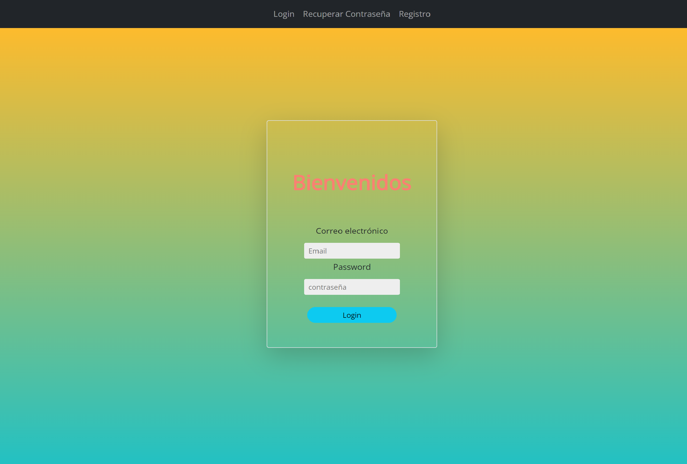
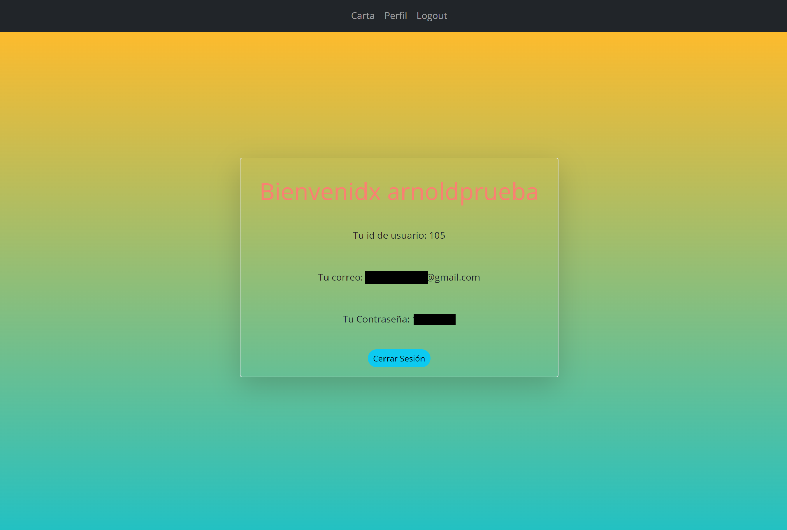
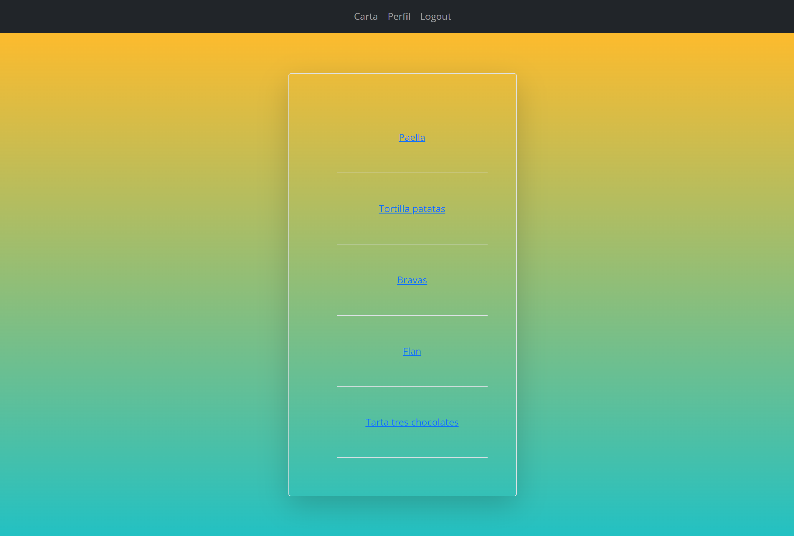
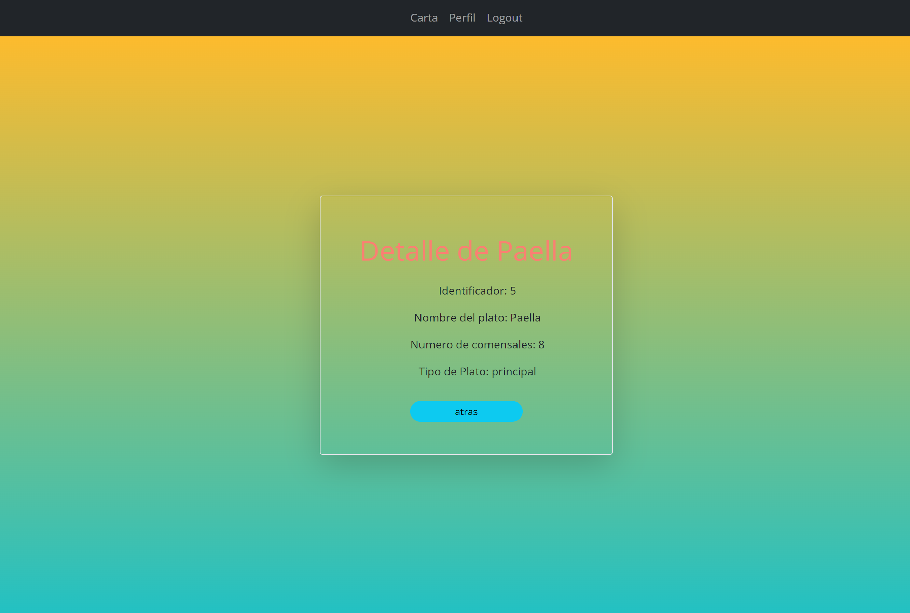
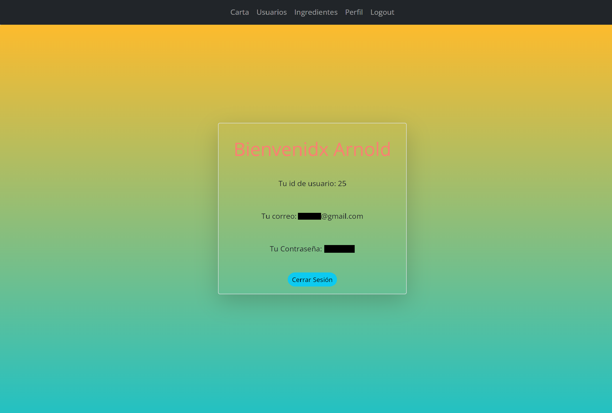
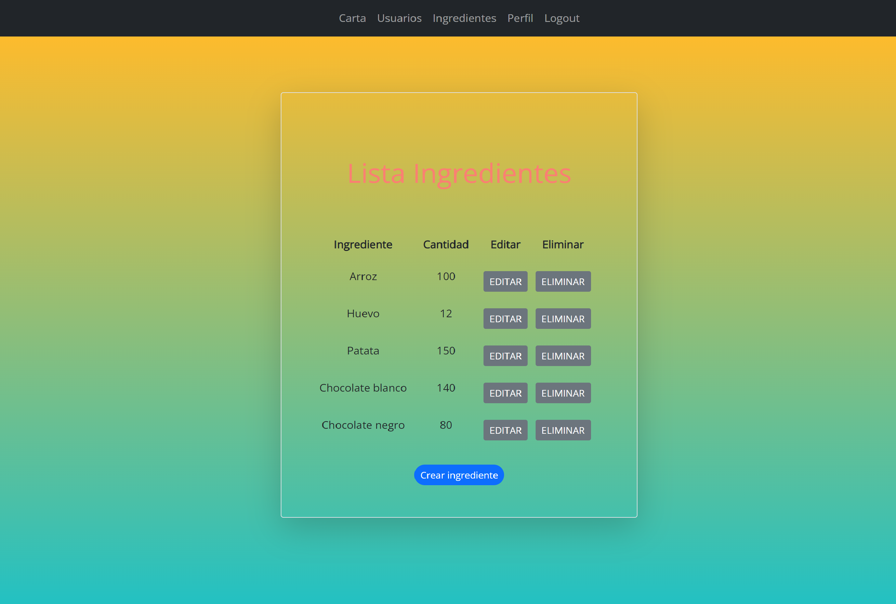
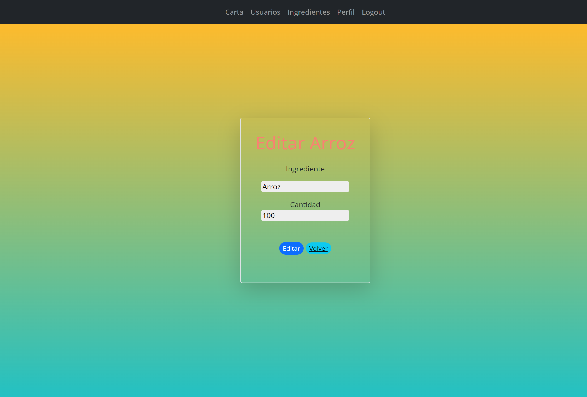
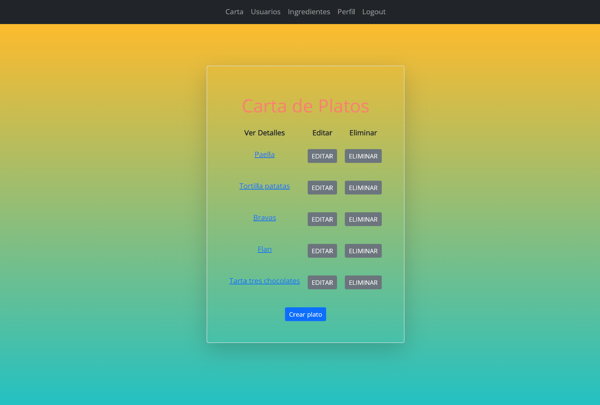
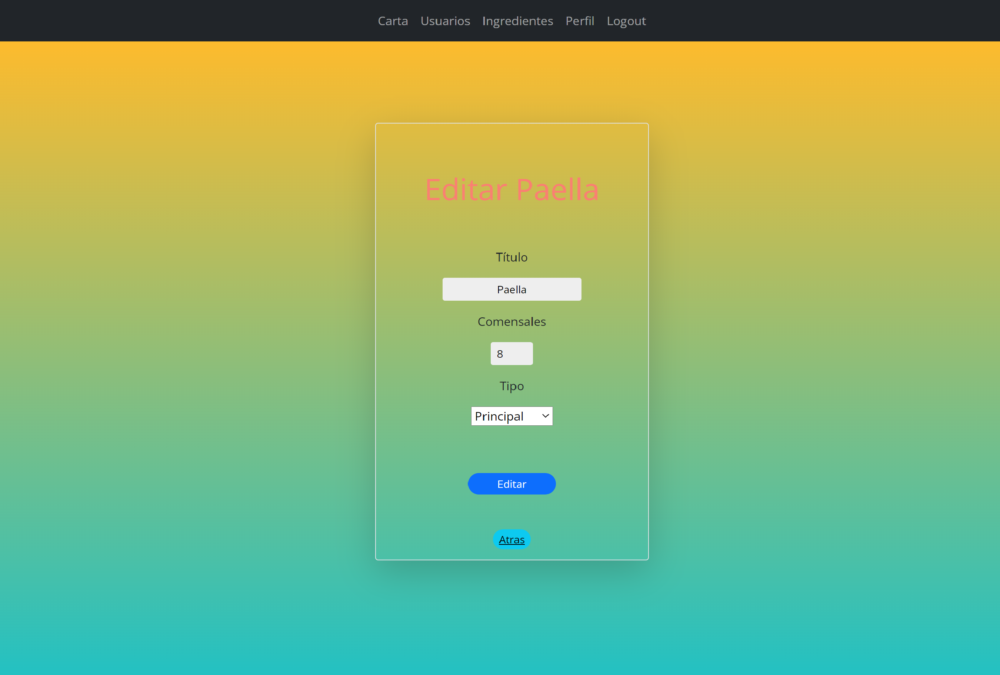
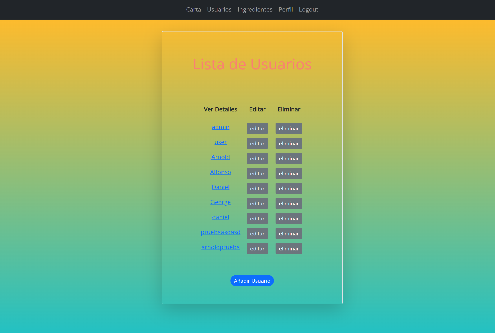

# PHP-Web-app

<h1>Web restaurante PHP</h1>

La APP se encuentra desplegada en heroku en el siguiente enlace: https://aadg-api-restaurante.herokuapp.com/pages/usuarios/loginUsuario.php 💻 📲

Las tecnologias usadas en este proyecto son las siguientes:📔

⚙️--->PHP
⚙️--->HEROKU
⚙️--->CSS3
⚙️--->APACHE
⚙️--->XAMPP
⚙️--->BOOTSTRAP
⚙️--->DOCKER(para pruebas locales)
⚙️--->WORKBENCH
⚙️--->xdebug
⚙️--->MYSQL

<h1>📺Páginas:</h1>

<h2>Página Home:</h2>

 

  

Esta es la página principal de la web , donde el usuario tendrá la opción de iniciar sesión o registrarse,
si todo es correcto será redirigido a la página de perfil.

 

<h2>Registro de los usuarios:</h2>

 

  

Para registrarse el usuario necesitara introducir : 'Nombre, Email, Contraseña'.
El nombre no debe contener solo números, el email debe contener @ y punto, la contraseña debe tener un mínimo de 8 carácteres.

 

<h2>Página de perfil:</h2>

 

  

En esta pantalla se encuentran los datos del usuario registrado, tambien podra cerrar la sesión.

 

<h2>Carta de platos:</h2>

 
Aquí se muestra la información de todos los platos alojados en la base de datos (ℹ️),
con la opcion de editar o eliminar si es administrador, al contrario de un usuario normal al que que no se le muestra esa infromación, como podéis comprobar al hacer click en una de las opciones se muestran los ingredientes y los comensales máximos para cada plato 🔄.

 

  

  

 

<h2>Página Admin:</h2>

 
Si se inicia sesión como Admin se despliegan los nuevos menus, con acceso a los platos e ingredientes para poder añadir nuevos o quitarlos.

 

  

 

<h2>Página Ingredientes:</h2>

 

Aqui se pueden añadir nuevos ingredientes o eliminarlos al acceder como Admin.

 

  

  

  

  

 

<h2>Lista de usuarios:</h2>

 

Aqui se pueden ver los usuarios editarlos o eliminarlos al acceder como Admin.

 

  

 

<h1>Equipo de trabajo🧰</h1>

 
Este proyecto ha sido realizado por 4 compañeros : Daniel Jesus,  George, Alfonso y Arnold.
Cada uno se ha centrado en unos de los puntos en concreto para la página.

 

*Daniel Jesus : Crud de usuarios.

*George : Crud de Ingredientes.

*Alfonso : Toda la parte frontal y visual.

*Arnold : Crud de platos.

